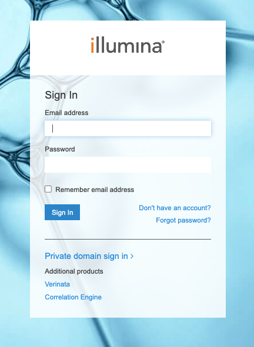
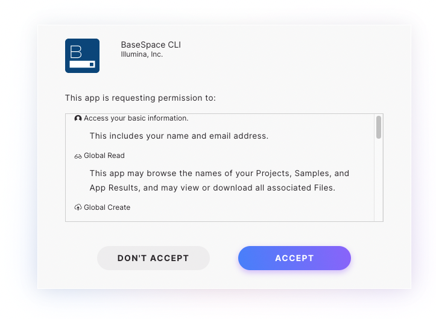

# Download data or whole Illumina runs from BaseSpace  

The purpose of this capsule is to download a project or fastq reads directly from [BaseSpace](https://login.illumina.com/platform-services-manager/?rURL=https://basespace.illumina.com&clientId=basespace&clientVars=aHR0cHM6Ly9iYXNlc3BhY2UuaWxsdW1pbmEuY29tL2Rhc2hib2FyZA&redirectMethod=GET#/), without having to transfer to AWS, Dropbox or similar application, or a local machine before transfering again to Code Ocean. 

**Step 1**: Fill out the app panel to indicate what you want to download. You should be able to find the Run ID or Project ID by browsing to the appropriate run or project and then looking at the URL. For example, 

https://basespace.illumina.com/run/236482248/details has a Run ID of 236482248

https://basespace.illumina.com/projects/159738596/about has an Project ID of 159738596

**Step 2**: Run the capsule.

**Step 3**: Click on the link in the output file to authenticate the software.  You will be brought to a page to sign in to the Illumina website and you must sign into BaseSpace using your own credentials.

Then you must accept the following permissions:

You will only be able to download runs that you own or that are shared with you. If not clicked, the link to authenticate the software will expire after 2 minutes, and the capsule run will fail. 

**Step 4**: Create a data asset from the output of this capsule to analyze your data. 

## Input
None 

## Output
The Illumina run or demultiplexed fastq files

## App Panel Parameters

Project or Run ID
- Found in basespace.illumina.com URL for that project or run. **Note that these IDs are different.**
- You will only be able to download runs that you own or are shared with you. 

Download the entire RUN or demultiplexed files (PROJECT)
- Determine whether you want all associated data (the Run folder) or just the demultiplexed fastq.gz files (project) [Default: project]

## Documentation
https://developer.basespace.illumina.com/docs/content/documentation/cli/cli-overview

[Code Ocean](https://codeocean.com/) is a cloud-based computational platform that aims to make it easy for researchers to share, discover, and run code.  

